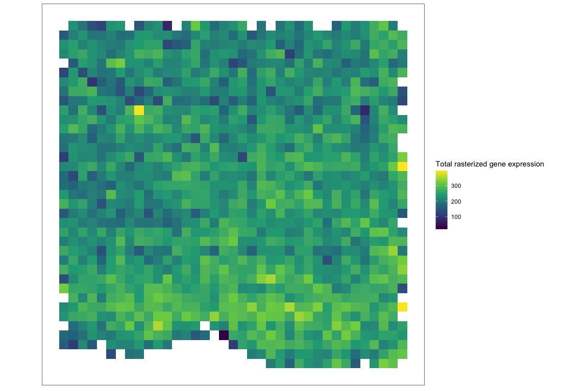
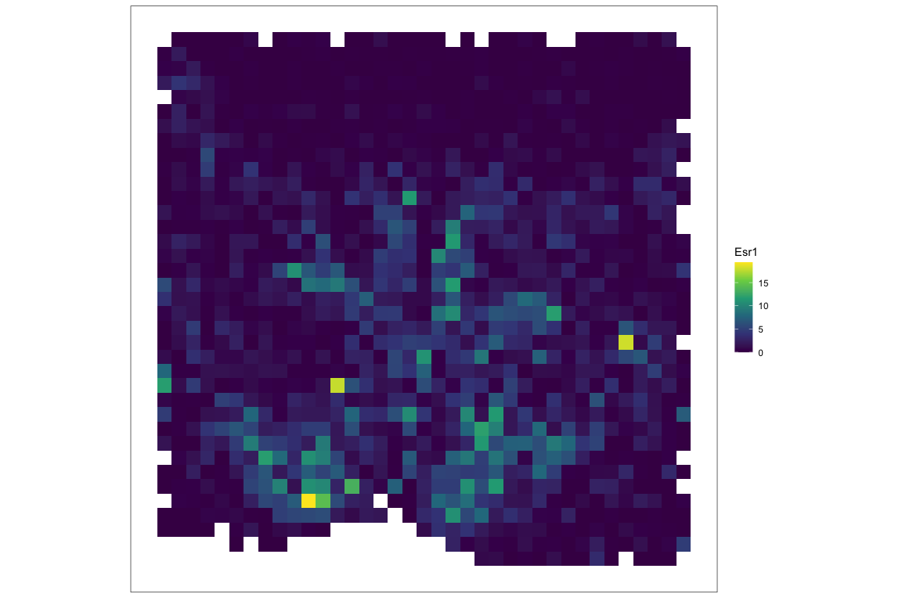
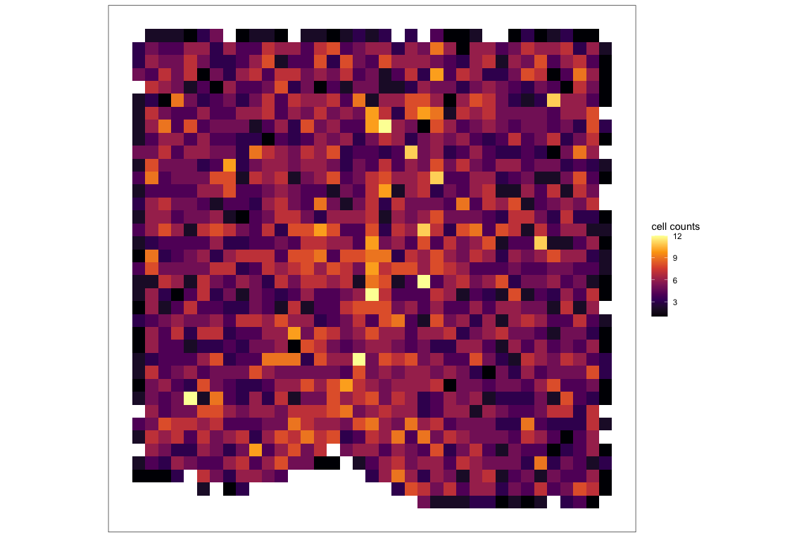
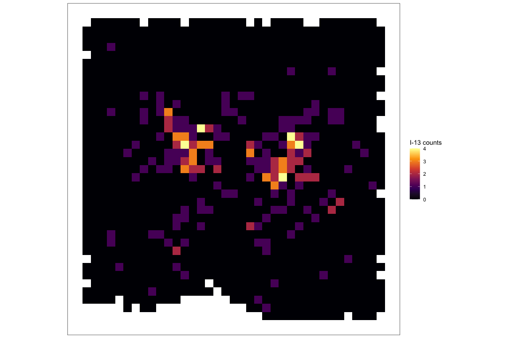
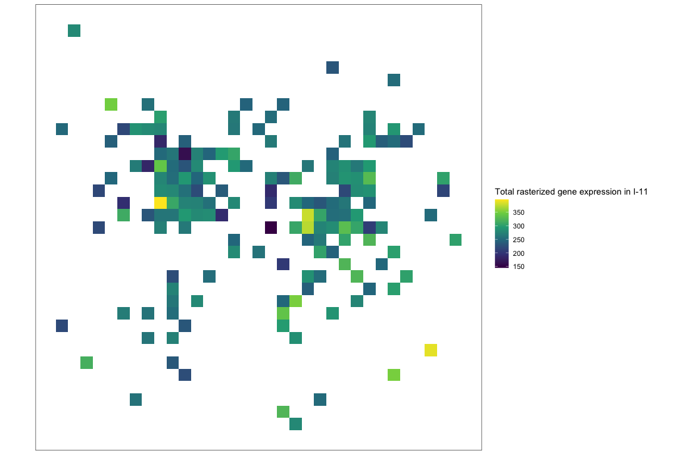

``` r
library(SpatialExperiment)
#> Loading required package: SingleCellExperiment
#> Loading required package: SummarizedExperiment
#> Loading required package: MatrixGenerics
#> Loading required package: matrixStats
#> 
#> Attaching package: 'MatrixGenerics'
#> The following objects are masked from 'package:matrixStats':
#> 
#>     colAlls, colAnyNAs, colAnys, colAvgsPerRowSet, colCollapse,
#>     colCounts, colCummaxs, colCummins, colCumprods, colCumsums,
#>     colDiffs, colIQRDiffs, colIQRs, colLogSumExps, colMadDiffs,
#>     colMads, colMaxs, colMeans2, colMedians, colMins, colOrderStats,
#>     colProds, colQuantiles, colRanges, colRanks, colSdDiffs, colSds,
#>     colSums2, colTabulates, colVarDiffs, colVars, colWeightedMads,
#>     colWeightedMeans, colWeightedMedians, colWeightedSds,
#>     colWeightedVars, rowAlls, rowAnyNAs, rowAnys, rowAvgsPerColSet,
#>     rowCollapse, rowCounts, rowCummaxs, rowCummins, rowCumprods,
#>     rowCumsums, rowDiffs, rowIQRDiffs, rowIQRs, rowLogSumExps,
#>     rowMadDiffs, rowMads, rowMaxs, rowMeans2, rowMedians, rowMins,
#>     rowOrderStats, rowProds, rowQuantiles, rowRanges, rowRanks,
#>     rowSdDiffs, rowSds, rowSums2, rowTabulates, rowVarDiffs, rowVars,
#>     rowWeightedMads, rowWeightedMeans, rowWeightedMedians,
#>     rowWeightedSds, rowWeightedVars
#> Loading required package: GenomicRanges
#> Loading required package: stats4
#> Loading required package: BiocGenerics
#> 
#> Attaching package: 'BiocGenerics'
#> The following objects are masked from 'package:stats':
#> 
#>     IQR, mad, sd, var, xtabs
#> The following objects are masked from 'package:base':
#> 
#>     anyDuplicated, aperm, append, as.data.frame, basename, cbind,
#>     colnames, dirname, do.call, duplicated, eval, evalq, Filter, Find,
#>     get, grep, grepl, intersect, is.unsorted, lapply, Map, mapply,
#>     match, mget, order, paste, pmax, pmax.int, pmin, pmin.int,
#>     Position, rank, rbind, Reduce, rownames, sapply, setdiff, sort,
#>     table, tapply, union, unique, unsplit, which.max, which.min
#> Loading required package: S4Vectors
#> 
#> Attaching package: 'S4Vectors'
#> The following object is masked from 'package:utils':
#> 
#>     findMatches
#> The following objects are masked from 'package:base':
#> 
#>     expand.grid, I, unname
#> Loading required package: IRanges
#> Loading required package: GenomeInfoDb
#> Loading required package: Biobase
#> Welcome to Bioconductor
#> 
#>     Vignettes contain introductory material; view with
#>     'browseVignettes()'. To cite Bioconductor, see
#>     'citation("Biobase")', and for packages 'citation("pkgname")'.
#> 
#> Attaching package: 'Biobase'
#> The following object is masked from 'package:MatrixGenerics':
#> 
#>     rowMedians
#> The following objects are masked from 'package:matrixStats':
#> 
#>     anyMissing, rowMedians
library(SEraster)
```

Load data

``` r
data("merfish_mousePOA")
merfish_mousePOA
#> class: SpatialExperiment 
#> dim: 155 6509 
#> metadata(0):
#> assays(1): volnorm
#> rownames(155): Ace2 Adora2a ... Ucn3 Vgf
#> rowData names(0):
#> colnames(6509): 6d6b1d59-6f3b-4a9d-b5a4-8c8b073ae025
#>   76200644-c14a-4cfa-8752-2a02e5f10d20 ...
#>   6b666f81-7b73-4100-9e02-b5381b39f0f3
#>   fdcddd97-7701-462a-b48f-979111245bd5
#> colData names(4): bregma celltype neurontype sample_id
#> reducedDimNames(0):
#> mainExpName: NULL
#> altExpNames(0):
#> spatialCoords names(2) : x y
#> imgData names(0):
```

Rasterize gene expression

``` r
## rasterize gene expression
rastGexp <- SEraster::rasterizeGeneExpression(merfish_mousePOA, assay_name="volnorm", resolution = 50)

## plot
SEraster::plotRaster(rastGexp, name = "Total rasterized gene expression")
```



``` r
SEraster::plotRaster(rastGexp, feature_name = "Esr1", name = "Esr1")
```



Rasterize cell-type

``` r
## rasterize cell type
rastCt <- SEraster::rasterizeCellType(merfish_mousePOA, col_name = "neurontype", resolution = 50)

## plot
SEraster::plotRaster(rastCt, name = "cell counts", option = "inferno")
```



``` r
SEraster::plotRaster(rastCt, feature_name = "I-13", name = "I-13 counts", option = "inferno")
```



Rasterize gene expression within cell-type

``` r
## rasterize cell-type specific gene expression by subsetting to cell-type of interest
cellsidx <- colData(merfish_mousePOA)$neurontype == 'I-13'
subset <- merfish_mousePOA[, cellsidx]

## rasterize gene expression
rastGexpSubset <- SEraster::rasterizeGeneExpression(subset, assay_name="volnorm", resolution = 50)

## plot
SEraster::plotRaster(rastGexpSubset, name = "Total rasterized gene expression in I-11")
```



``` r
SEraster::plotRaster(rastGexpSubset, feature_name = "Esr1", name = "Esr1 in I-13 inhibitory neurons")
```


